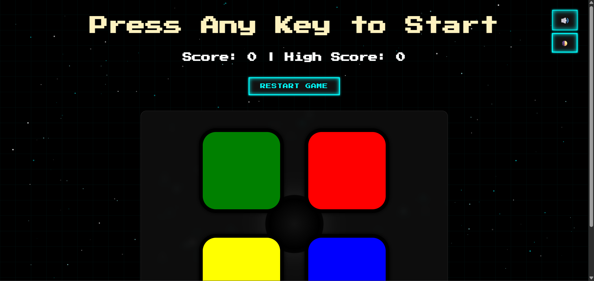

# 🎮 Retro Simon Memory Game

A fully responsive, visually enhanced version of the classic **Simon** game — built from scratch using **HTML**, **CSS**, and **JavaScript**.

[](https://tharunkrishna-spec.github.io/SIMONGAME/)

---

## 📌 Features

- 🎯 **Level-based Gameplay** – Match the increasing sequence of colors
- 🎵 **Background Music** – Includes mute/unmute toggle
- 🌗 **Light/Dark Theme Switcher** – Retro + modern vibes
- 💾 **High Score Memory** – Saved using `localStorage`
- 🌀 **Animated Particle Effects** – Adds visual interactivity
- 🖱️ **Mouse + Touch Support** – Works on both desktop & mobile
- 🔁 **Restart Button** – Clean reset anytime

---

## 🛠️ Tech Stack

- HTML5  
- CSS3 with animations  
- JavaScript (DOM, Events, Audio API, Local Storage)  
- `tsParticles.js` for effects

---

## 📸 Screenshots

 


---

## 🎮 How to Play
1. Press any key to start.
2. Watch the color sequence.
3. Repeat the sequence by clicking the colored buttons in order.
4. The game gets harder as the sequence grows.
5. One wrong click = Game Over!

---

## 🛠️ How to Run Locally
1. Clone this repo:
   ```bash
   git clone https://github.com/TharunKrishna-spec/SIMONGAME.git
   cd SIMONGAME
   Open index.html in your browser
---
## 📂 Project Structure
SIMONGAME/
├── index.html
├── styles.css
├── game.js
└── sounds/
    ├── red.mp3
    ├── blue.mp3
    ├── green.mp3
    └── yellow.mp3

---

## 🧠 Concepts Learned

- DOM manipulation
- Event handling
- Working with arrays and randomization
- Audio playback in JavaScript
- UI/UX considerations in game design

---

## ✍️ Author

**Tharun Krishna Suresh**  
🎓 Electronics and Computer engineering @ Vellore Institute of technology Chennai
💡 Passionate about web dev ,electronics,AI and ML  
🔗 [GitHub](https://github.com/TharunKrishna-spec)  
🔗 [LinkedIn](https://www.linkedin.com/in/tharun-krishna-aa5580324/)

---

## 🏁 Status
✅ Completed — may add animations / new themes later!

---

## 📜 License
This project is open source and available under the MIT License.


Let me know if you want to add things like animations, leaderboard support, or screenshots — I can update this accordingly!
Made with ❤️ by Tharun Krishna